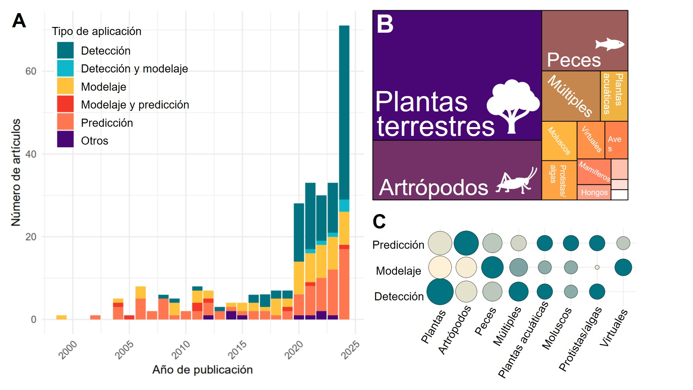

# AIForInvasionBiology_Ecosistemas
Data and code of the published article from Fenollosa and Salguero-Gómez in Ecosistemas, entitled "AI and Big Data for invasion biology: finding, modelling and forecasting the population dynamics of invaders", where a systematic review of the published research in invasion biology using artificial intelligence was performed. 

Article link will be updated here soon.

The repository contains three folders: 
- Data: Contains the results of the systematic review conducted
- Script: contains the code to produce the manuscript figures
- Results: Contains the Manuscript figures
- Manuscript: Contains the manuscript in different languages

[Figure 2](https://github.com/erolafr/AIForInvasionBiology_Ecosistemas/blob/main/Results/Figure2.jpg)

